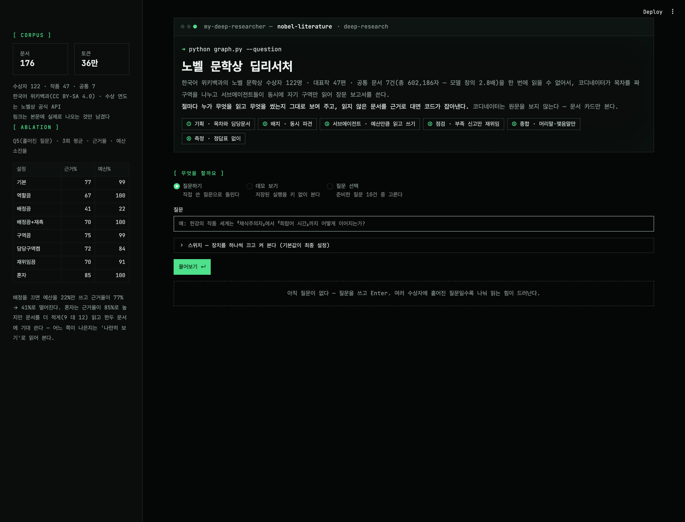
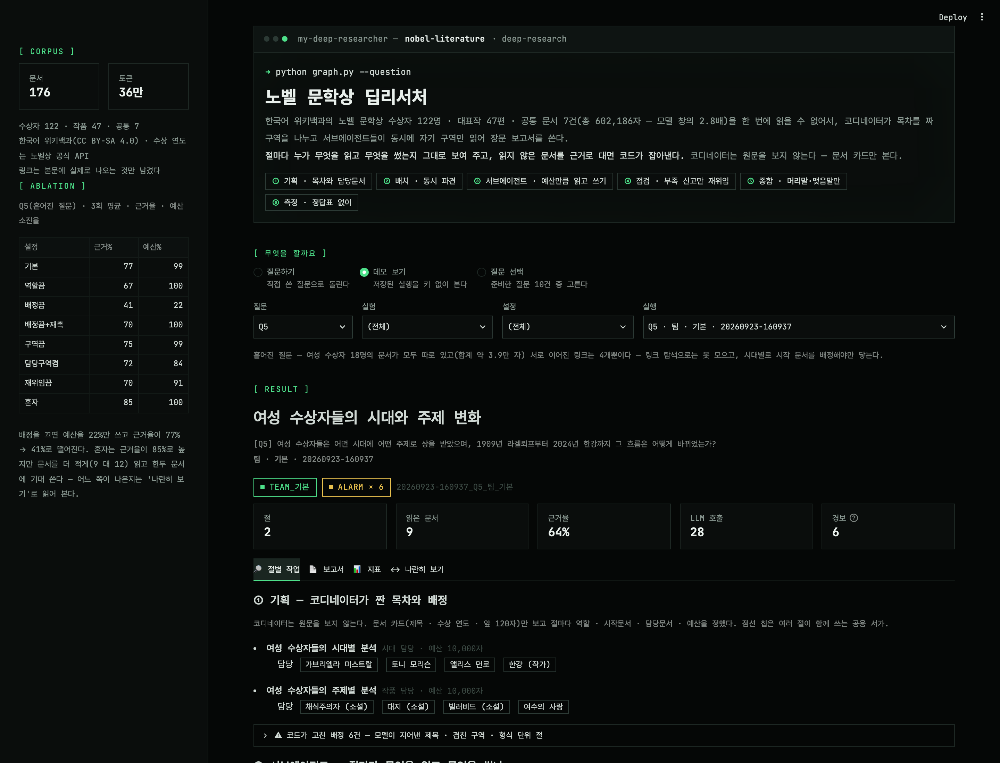
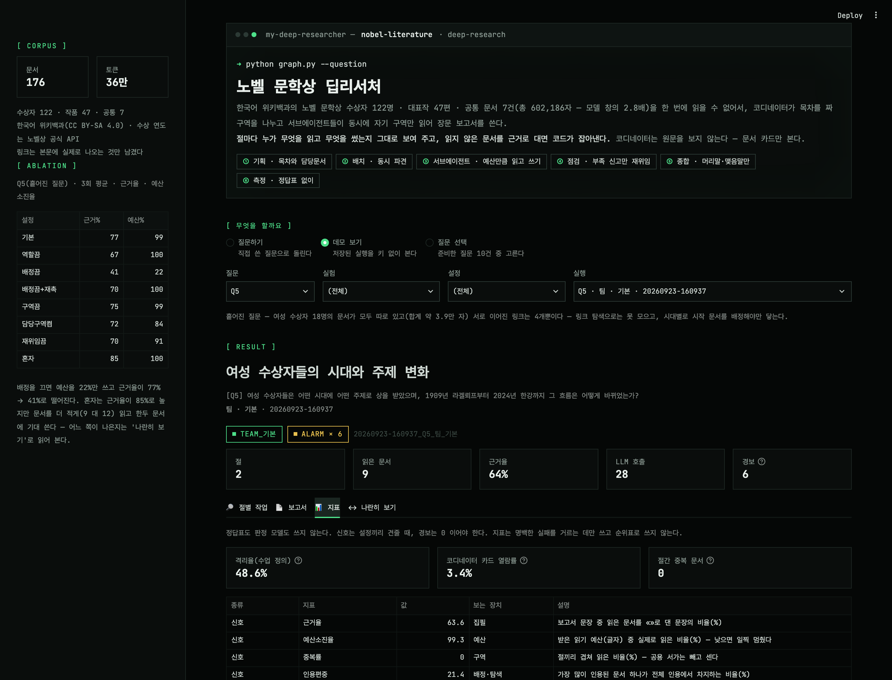
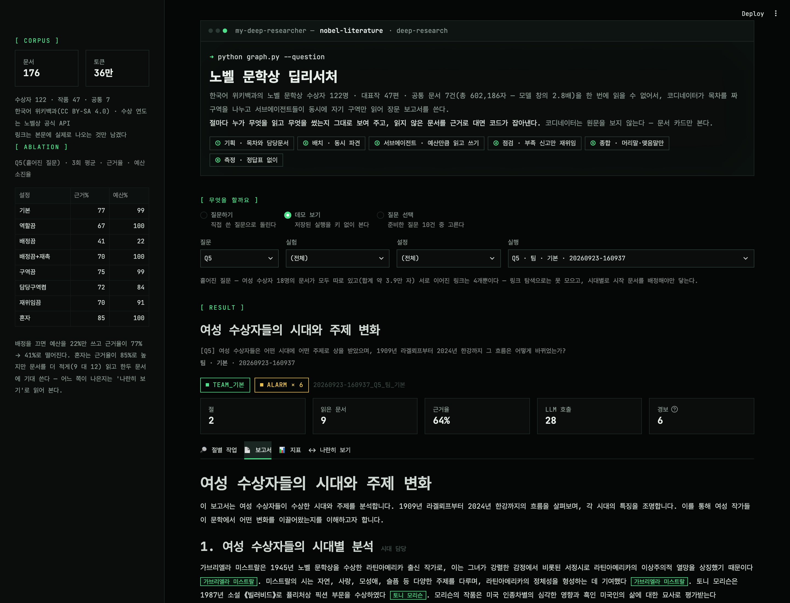
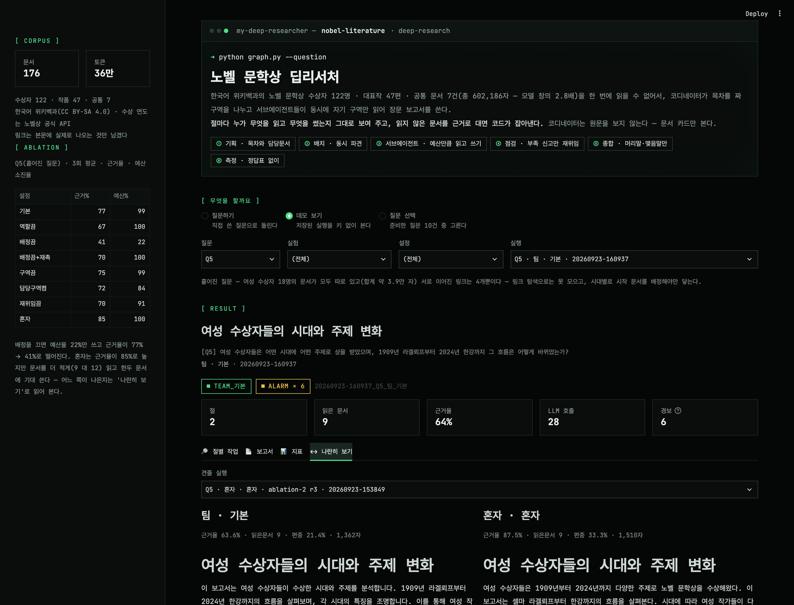

# my-deep-researcher — 노벨 문학상 딥리서처

한국어 위키백과의 노벨 문학상 수상자 122명 · 대표작 47편 · 공통 문서 7건을 코퍼스로 삼아,
코디네이터가 목차를 짜 구역을 나누고 서브에이전트들이 동시에 자기 구역만 읽은 뒤 장문 보고서를 쓰는 LangGraph 파이프라인.

> 「에이전트 팀 꾸리기」 9장 프로젝트. 설계 · 실험 결과 · 사람의 판단은 [REPORT.md](REPORT.md) 에 정리했다.

```
질문 → ① 기획(목차 · 역할 · 담당문서 · 예산) → ② 배치(서브에이전트 동시 파견, 남의 구역 알림)
     → ③ 서브에이전트(예산만큼 읽고 «근거»를 달아 절 원고) → ④ 점검(부족 신고한 절만 재위임)
     → ⑤ 종합(머리말 · 맺음말만, 본문은 원고 그대로) → ⑥ 측정(정답표 없이)
```

## 구조

```
data/                corpus.json (docs + links) · questions.json · award_years.json · seed_check.json
config.json          도메인에 묶인 값 (절수 · 절예산 · 바퀴 상한 · 역할 명단)
collect_corpus.py    위키백과 코퍼스 수집
check_seeds.py       수상자 명단을 노벨상 공식 명단과 대조 (비교만, 수정 안 함) · 수상 연도 표
graph.py             기획 → 배치 → 서브에이전트 → 점검 → 종합 → 측정, 실행 저장
metrics.py           지표 — 정답표를 쓰지 않는다 (신호 · 경보)
titles.py            문서 제목 맞추기 규칙 — graph(인용 검사)와 metrics(근거율)가 같이 쓴다
baseline.py          혼자 하는 대조군 (짝 팀 실행이 실제로 읽은 만큼 예산)
ablation.py          스위치를 하나씩 끄고 재는 실험
app.py               데모 (streamlit) · .streamlit/config.toml 은 화면 테마
compare.py           나란히 읽기 화면 (사람이 판단)
make_screenshots.py  데모 화면 캡처
output/              runs.jsonl · ablation.json · ablation-1.json · reports/ · compare/
docs/                reading-notes.md (사람의 판단과 실패 추적) · screenshots/
tests/               pytest — 가짜 모델(tests/fakes.py)로 네트워크 없이
```

## 설치

```bash
python3.14 -m venv .venv
.venv/bin/pip install -r requirements.txt   # 설치된 정확한 버전은 requirements-lock.txt
cp .env.example .env                        # OPENAI_API_KEY 채우기 (.env 는 저장소에 올라가지 않는다)
.venv/bin/pytest -q                         # 87개 — LLM · 네트워크 없이 돈다
```

## 실행

### 1. 코퍼스 (이미 `data/corpus.json` 으로 들어 있다 — 다시 모을 때만)

```bash
.venv/bin/python check_seeds.py              # 수상자 명단이 공식 명단과 같은지 먼저 본다 → data/award_years.json
.venv/bin/python collect_corpus.py --refresh # 한국어 위키백과에서 다시 모은다 (API 응답은 .cache/ 에 남는다)
.venv/bin/python collect_corpus.py --stats   # 모으지 않고 통계만
```

현재 코퍼스: 문서 176건(수상자 122 · 작품 47 · 공통 7), 602,186자, 359,510토큰 — gpt-4o-mini 창(128K 토큰)의 2.8배.

### 2. 파이프라인

```bash
.venv/bin/python graph.py --question Q5 --plan-only    # 기획만 — 목차 · 역할 · 담당문서 · 예산 확인
.venv/bin/python graph.py --question Q5                # 전 구간 → output/reports/*.md · output/runs.jsonl
.venv/bin/python graph.py --question "직접 쓴 질문"      # 질문 세트 밖의 질문
.venv/bin/python graph.py --question Q5 --print-report # 보고서 본문까지 출력
.venv/bin/python graph.py --question Q5 --no-배정       # 켜진 스위치 끄기 (--no-역할 · --no-배정 · --no-구역 · --no-재위임)
.venv/bin/python graph.py --question Q5 --재촉          # 꺼진 스위치 켜기 (--담당구역 · --재촉)
```

`담당구역`(남의 담당문서까지 피하기)과 `재촉`(그만 읽으려 할 때 붙잡기)은 기본이 꺼져 있다 — 실험용 스위치다.

### 3. 혼자 하는 대조군

```bash
.venv/bin/python baseline.py --question Q5    # 같은 질문의 최근 팀 실행과 짝 — 그 실행이 실제로 읽은 글자만큼 예산을 받는다
```

### 4. 절제 실험

```bash
.venv/bin/python ablation.py                    # Q2·Q5·Q8 × 설정 8개 × 3회 = 72번 (끊겨도 다시 부르면 이어서)
.venv/bin/python ablation.py --summarize-only   # LLM 없이 output/runs.jsonl 에서 요약표만 → output/ablation.json
.venv/bin/python ablation.py --remeasure        # 지표 규칙을 고쳤을 때 — 저장된 실행 전부의 지표를 LLM 없이 다시 잰다
```

- `output/ablation.json` — **ablation-2**(최종): 기본 · 역할끔 · 배정끔 · 배정끔+재촉 · 구역끔 · 담당구역켬 · 재위임끔 · 혼자
- `output/ablation-1.json` — ablation-1(기록용): 이 실험에서 후보 목록이 앞 80건만 보이던 버그를 찾았고,
  구역 기본값을 수업 방식으로 바꿨다. 그래서 최종 결론에는 쓰지 않는다.

지표는 [metrics.py](metrics.py) 의 `METRICS` 표에 이름 · 종류(신호/경보) · 보는 장치 · 한 줄 설명이 있다.
저장된 실행 기록만으로 다시 계산되므로 LLM 없이 비교할 수 있다.

### 5. 웹 데모

```bash
.venv/bin/streamlit run app.py    # http://localhost:8501 — 이 폴더에서 실행해야 .streamlit/config.toml 테마가 적용된다
```

첫 화면에서 **무엇을 할까요**를 고른다.

1. **질문하기**(기본) — 질문을 직접 쓰고 Enter. 스위치를 켜고 끌 수 있고, 진행 로그가 실시간으로 뜬다(`.env` 필요).
2. **데모 보기** — `output/runs.jsonl` 에 저장된 실행(팀 · 혼자 · 절제 설정)을 고른다. **API 키 없이** 열린다.
3. **질문 선택** — 준비한 질문 10건(`data/questions.json`) 중 하나를 골라 돌린다.

결과 탭: **절별 작업**(코디네이터가 무엇을 배정했고 서브에이전트가 무엇을 읽어 무엇을 썼는지, 어느 원고가 채택됐는지) ·
보고서 · 지표(신호/경보, 격리 숫자 셋) · 나란히 보기(같은 질문의 다른 실행과 좌우 비교)

화면 스타일은 my-graph-agent 와 같은 **터미널 콘솔 디자인 시스템(범용판)**을 따른다 — 테마 토큰은
`.streamlit/config.toml`, 테마로 못 옮기는 것(섹션 라벨 · 상태 배지 · 액자 · 칩)은 `app.py` 의 CSS.
강조색은 하나(`#4ee08a`), 모서리는 사각, 채운 강조 버튼은 화면당 하나.



| 절별 작업 | 지표 |
|---|---|
|  |  |
| **보고서** | **나란히 보기** |
|  |  |

화면 캡처는 데모를 띄워 둔 채로 `make_screenshots.py` 로 다시 만든다. playwright 가 필요한데, 캡처에만 쓰므로
requirements.txt 에는 넣지 않았다(`.venv/bin/pip install playwright && .venv/bin/playwright install chromium`).

### 6. 나란히 읽기 (사람이 판단하는 화면)

```bash
.venv/bin/python compare.py --question Q5     # output/compare/ablation-2_Q5_기본-vs-혼자.html
```

같은 회차의 팀 · 혼자 보고서를 나란히 놓고 읽는다. 읽은 판단과 실패 추적은 [docs/reading-notes.md](docs/reading-notes.md).

## 자료 출처

코퍼스는 [한국어 위키백과](https://ko.wikipedia.org) 문서를 MediaWiki API 로 받은 것이며
[CC BY-SA 4.0](https://creativecommons.org/licenses/by-sa/4.0/deed.ko) 을 따른다.
수상 연도와 수상자 명단 대조는 [노벨상 공식 API](https://api.nobelprize.org/2.1/laureates)(nobelprize.org)를 썼다.
