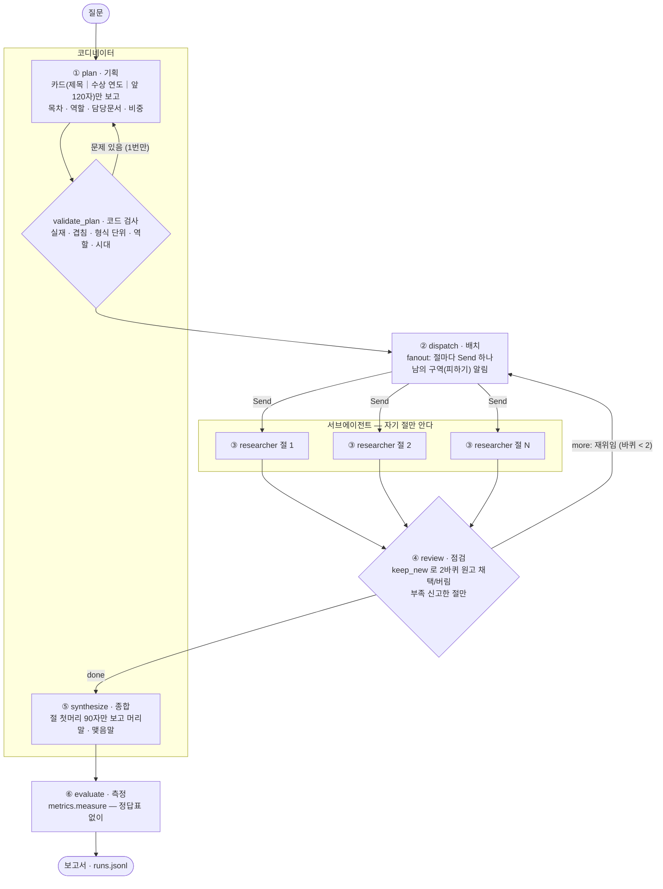

# 노벨 문학상 딥리서처 - 딥리서치 에이전트 보고서

> 실행 방법은 [README.md](README.md), 
> 사람이 읽은 판단의 원본 기록은 [docs/reading-notes.md](docs/reading-notes.md)
> 숫자는 모두 `output/ablation.json`(ablation-2 — 설정 8개 × 질문 3개 × 3회 = 72번)과 `output/runs.jsonl` 에서 왔다.
> 제출 뒤에 한 기획 강화(§5 끝)는 `output/ablation-3.json`(30번)과, 기획만 따로 잰 개발 기록(저장소에는 넣지 않았다)에서 왔다.

## 요약

- **무엇을** — 한국어 위키백과의 노벨 문학상 수상자 122명 · 대표작 47편 · 공통 문서 7건(602,186자, 359,510토큰 — gpt-4o-mini 창의
  2.8배)을 코디네이터가 구역으로 나누고, 서브에이전트들이 동시에 자기 구역만 읽어 장문 보고서를 쓴다.
- **무엇이 값을 했나** — **배정(절마다 담당문서)**. 끄면 흩어진 질문(Q5)에서 예산을 22%만 쓰고 근거율이 77% → 41%로 떨어진다.
  '그만 읽겠다'는 서브에이전트를 붙잡으면(재촉) 70%까지 회복하지만 절끼리 같은 문서를 읽고(중복 20%) LLM 호출이 두 배다 —
  배정의 몫은 **안 겹치게, 적은 호출로**다. 역할 · 재위임 · 피하기 목록의 효과는 3회 × 2실험으로 가를 수 없었다.
- **팀 대 혼자** — 지표로는 팀이 넓고 고르게 읽는다(Q5 읽은 문서 11.7 대 8.7, 인용 편중 15.5% 대 28.6%). 사람이 나란히 읽은
  판단은 **Q5 는 팀**(더 넓다), **Q8 은 대체로 팀이지만 맺음말과 편집은 혼자**였다. 원인은 격리 — 편집자가 원고 첫머리 90자만 보고
  본문을 고치지 않는 설계에서 왔다. 한 건으로 답이 나오는 Q2 에서는 팀을 쓸 이유가 없었다.
- **격리** — 코디네이터는 원문을 한 글자도 보지 않는다(문서 카드만, 코퍼스의 3.2\~3.3%). 팀 기본 9회에서 두 절이 같은 문서를
  읽은 경우 0건, 읽지 않은 문서를 근거로 댄 허위인용 0건.
- **제출 뒤 — 기획 강화** — 가장 불안정했던 기획을 고쳐 봤다. 모델 입력(카드 · 지시문 · 재기획 문구)을 바꾼 세 시도는 모두
  목차를 망가뜨리거나 효과가 없었고, **남은 효과는 모두 코드 쪽**이다 — 시대 절 연도 검사(Q5 시대불일치 켬 0 · 끔 4),
  빈 절의 물음 나눠 주기(Q8 본문에서 두 사람을 견준 문장 켬 회차마다 2\~5 · 끔 0). 사람의 판단도 Q8 은 켬이 나았다.
  그리고 **같은 입력에도 모델 경향이 묶음마다 달라**, 설정은 같은 시간대에 번갈아 재야 비교가 된다.

---

## 1. 주제와 코퍼스

### 왜 이 주제인가
- 이전 프로젝트(my-graph-agent — 수상자 60건 지식그래프)의 확장이다. 한 질문의 답이 **여러 수상자 문서에 흩어져** 있고
  (여성 수상자 18명은 서로 이어진 링크가 4개뿐), 수상자 · 작품 · 사조가 **서로를 가리키며**, 답이 **장문**이어야 한다 —
  강의의 주제 고르기 네 조건을 모두 채운다.
- 주제 후보는 영화 · 커피 · AI · 게임 · 유전학 · 인도차이나사 · 스마트폰 · 오픈소스를 거쳐 노벨상 분야별로 좁혔고,
  위키백과 문서 길이를 미리 재서 골랐다.

### 무엇을 얼마나 모았나 (`collect_corpus.py` → `data/corpus.json`)

| 종류 | 건수 | 규칙 |
|---|---|---|
| 수상자 | 122 | `분류:노벨 문학상 수상자` 121명 + 노벨상 공식 명단과 대조해 찾은 분류 누락 1명(2025년 크러스너호르커이 라슬로) |
| 작품 | 47 | 수상자 본문이 가리키는 작품, 작가당 최대 3편. **'〈작가〉의 소설' 분류**로 주인 확인(없으면 도입부 200자에 작가명) |
| 공통 | 7 | 시드 5명 이상이 함께 가리키는 문학 관련 문서(노벨 문학상 · 노벨상 · 공산주의 · 문학 · 사회주의 · 모더니즘 · 철학) |
| **합계** | **176건 · 602,186자 · 359,510토큰** | gpt-4o-mini 창(128K)의 **2.8배** — 한 번에 넣을 수 없다는 것이 이 구조의 전제 |

강의의 「위키백과 코퍼스 수집 프롬프트」를 따르고 다음만 바꿨다(이유는 `collect_corpus.py` docstring).

1. **토막글 기준 3,000자 → 800자, 수상자는 길이와 무관하게 전원.** 수상자 문서 위키텍스트 중앙값이 약 5.5KB라 3,000자로 자르면
   20\~40명만 남는다. 800자 미만 수상자 5명(싱어 379자 등)은 예외로 넣고 `_짧은수상자`에 기록했다.
2. **링크는 본문에 실제로 나오는 것만.** 수상자 문서 하단의 틀(navbox)이 수상자 전원을 서로 이어, `prop=links` 그대로면
   완전 그래프가 된다. 정리 뒤 문서당 링크 수 중앙값 2, 링크가 0개인 문서 2건, 아무도 가리키지 않는 문서 27건 —
   탐색만으로는 닿지 못하는 자리라 **배정이 유일한 경로**가 된다.
3. **작품 주인 확인.** 처음엔 '본문에 작가명이 나오면'으로 판정했다가 『신곡』(오에 겐자부로 문서가 가리킴), 『잃어버린 시간을 찾아서』,
   브리태니커 백과사전('아나톨 **프랑스**'의 '프랑스') 등 남의 것 6건이 섞였다 → 분류 기준으로 바꿔 0건.
4. **수상 연도는 노벨상 공식 API**(→ `data/award_years.json`, 대조 스크립트는 개발용이라 저장소에 넣지 않았다). 공식 데이터 쪽 오류도 하나 찾았다 —
   르 클레지오의 공식 위키데이터 ID가 그의 작품 항목을 가리켜, 이름으로 짝지어 보고한다.

### 질문 세트 (`data/questions.json`, 정답표 없음)

10건을 성격이 갈리게 섞었다. 질문마다 "왜 나눌 만한가"를 한 줄로 적었다.

| 성격 | 질문 | 왜 나눌 만한가(요지) |
|---|---|---|
| 한건 | Q1 『시지프 신화』의 부조리 · **Q2 노벨 문학상 선정 방식** | 나눌 이유가 없다 — 한 문서에 답이 있다. **이 구조를 쓰면 안 되는 경우**를 보이려고 넣었다 |
| 흩어진 | Q3 권력과의 충돌 · Q4 망명 · **Q5 여성 수상자의 흐름** · Q6 수상 거부 · Q7 전쟁 체험 | 답의 조각이 여러 수상자 문서에 흩어져, 구역을 나눠 동시에 읽을 이유가 가장 크다 |
| 추적 | **Q8 사르트르 ↔ 카뮈** · Q9 솔제니친 · Q10 한강의 작품 세계 | 링크를 따라가야 한다. Q9 · Q10 은 갈래가 좁아 나눌 가치가 적을 수 있는 경계 사례 |

절제 실험은 성격마다 하나씩 Q2 · Q5 · Q8 로 돌렸다.

## 2. 분업 설계

### 역할 명단 (`config.json`)
생애 · 작품 · 사상 · 시대 · 비교 · 수상 담당 6개. 기본역할은 '수상 담당'. 코디네이터가 절마다 하나를 붙이고, 명단에 없는
역할은 코드가 기본역할로 바꾼다.

### 배정 · 구역 규칙

| 규칙 | 내용 | 왜 |
|---|---|---|
| **내용 단위 목차** | 코디네이터에게 사람 · 나라 · 시대 · 사례로 나누게 하고, 형식 단위(개요 · 배경 · 비교)의 나쁜 예를 보인다 | 형식으로 나누면 전원이 같은 자료를 읽는다 |
| **담당문서 2\~6건** | 절마다 시작문서 + 담당문서를 코퍼스 제목 그대로 배정 | 서브에이전트가 무엇부터 읽을지 — S7 에서 가장 값을 한 장치 |
| **코드가 배정을 검사** | 실재 여부 · 절끼리 겹침 · 형식 단위 절 · 역할 명단. 못 맞춘 제목은 엉뚱한 문서로 바꾸지 않고 빼고 교정 기록에 남긴다 | 모델은 코퍼스에 없는 그럴듯한 제목을 지어낸다(팀 기본 9회 배정 실패 4건) |
| **겹치면 재기획 1번** | 구역 겹침 2건 이상 · 빈 구역 · 형식 단위 절이면 코드가 문제를 알려 주고 다시 짜게 한다 | 겹침은 형식 단위 목차의 신호다 |
| **빈 구역 절은 파견하지 않음** | 재기획 뒤에도 담당문서가 없는 절(대개 '비교')은 빼고 예산을 나눠 준다 | 격리된 서브에이전트는 남의 절 자료를 볼 수 없어 비교 절은 재료가 없다 |
| *기획보강 (제출 뒤)* | 시대 절 연도 검사 · 가로지르는 절(비교 · 종합) 잡기 · 빈 절의 **지시**도 남은 절에 나눠 주기 · 구역을 가진 절 수를 줄이는 재기획은 받지 않기 — 모두 코드 쪽, 스위치로 끄면 제출본 그대로 | §5 끝 '기획 강화' |
| **공용 서가** | 공통 문서 7건은 여러 절이 함께 담당하고 피하기에 넣지 않는다 | 수업 코드의 교훈 "핵심 문서를 피하기에 넣지 말 것" |
| **남의 구역 = 다른 절의 시작문서 + 이미 읽은 문서** | 수업 방식. 남의 담당문서까지 피하는 방식(담당구역켬)과 S7 에서 비교해 이쪽으로 확정 | Q5 에서 담당구역켬이 근거율 71.7% 대 77.0%, 예산 소진 84% 대 99% — 나은 적이 없었다 |
| **카드에 공식 수상 연도 · 연도순** | 코디네이터는 원문 대신 카드(제목 ｜ 수상 연도 ｜ 앞 120자)만 본다 | 연도가 없을 때 Q5 목차는 대부분 형식 단위(생애 · 주제 · 배경)였고, 넣은 뒤 3번 모두 시대별(1909–1950 / 1951–2000 / 2001–2024)이 됐다. 여성 수상자 배정도 18명 중 7\~11명 → 12\~15명 |

### 예산 — 문서 건수가 아니라 읽은 글자 수
- 한 바퀴 2만 자(절 평균 5,000자 × 4). 수업 코드의 '절마다 3문서'를 이 코퍼스의 문서 길이 중앙값(1,549자)으로 옮긴 수준이다.
- 문서 길이가 379자~5만 자로 극단적이라 건수 예산이면 처칠 한 건과 싱어 한 건이 같은 값이 된다. 긴 문서는 한 번에
  2,500자씩 이어 읽고, 담당문서는 한 조각씩 먼저 다 훑은 뒤 이어 읽는다.
- 코디네이터가 절마다 비중(1\~3)을 매기면 전체 예산을 그 비율로 나눈다.

### 서브에이전트 설계 규칙
- 읽는 순서: 시작문서 → 담당문서(모델 호출 없이) → 읽은 문서가 가리키는 링크와 이어 읽을 문서 중 모델이 고른 것.
  링크가 바닥나면 수상자를 연도순으로 전부 보여 준다(처음엔 앞 80건만 보여 1990년대 이후 수상자가 안 보이는 버그가 있었다 — S7).
- 집필: 문장마다 **'근거' 칸을 데이터로 채우고 «제목»은 코드가 붙인다.** 처음엔 모델이 본문에 «»를 직접 넣게 했는데,
  《작품》 표기를 근거로 착각해 Q8 근거율이 0%였다 → 데이터로 받자 74%.
- 인용 검사(코드): 줄여 쓴 이름을 정식 제목으로 맞추고(`titles.py`), 읽지 않은 문서 = 허위인용, 코퍼스에 없는 이름 = 없는 문서 인용.
  인용이 하나도 없으면 읽기 없이 한 번 다시 쓰게 한다.
- **재위임**: 스스로 '부족'을 신고한 절만, "지난번에 무엇을 읽었고 무엇이 비었는지"를 붙여 다시 보낸다. 바퀴 상한 2.
- **두 번째 원고(`keep_new`)**: 허위 · 없는 문서 인용이 있거나 근거 문서 수가 줄면 버리고 첫 원고를 지킨다. 무조건 덮어쓰면
  인용을 빠뜨린 원고가 멀쩡한 원고를 지운다. ablation-2 에서 2바퀴 원고 60편 중 53편 채택 · 7편 버림.

## 3. 지표 — 정답표도 판정 모델도 쓰지 않는다

`metrics.py` 의 `METRICS` 표가 원본이다. 저장된 실행 기록만으로 LLM 없이 다시 계산된다(`ablation.py --remeasure`).
**신호**는 설정끼리 높낮이를 견줄 때만, **경보**는 0 이어야 한다. 순위표로 쓰지 않는다.

| 종류 | 지표 | 보는 장치 | 한 줄 설명 |
|---|---|---|---|
| 신호 | 근거율 | 집필 | 보고서 문장 중 읽은 문서를 «»로 댄 문장의 비율 |
| | 예산소진율 | 예산 | 받은 읽기 예산 중 실제로 읽은 비율 — 낮으면 일찍 멈췄다 |
| | 중복률 | 구역 | 절끼리 겹쳐 읽은 비율(공용 서가 제외) |
| | 인용편중 | 배정 · 탐색 | 가장 많이 인용된 문서 하나의 비중 |
| | 읽고안쓴비율 | 탐색 | 읽었지만 인용하지 않은 문서 비율 |
| | 격리율 | 격리 | 모델이 본 글자 중 코디네이터 몫(수업 정의) |
| | 코디카드열람률 | 격리 | 코디네이터가 기획 한 번에 본 글자 ÷ 코퍼스 — 원문은 보지 않는다 |
| | 읽은문서 · 보고서자수 · LLM호출 | 탐색 · 종합 · 비용 | 규모 |
| 경보 | 허위인용 · 없는문서인용 · 제거된인용 | 집필 · 인용검사 | 읽지 않은 문서 / 코퍼스에 없는 이름 / 코드가 지운 틀린 표시 |
| | 인용0곳절 · 빈원고절 | 집필 · 탐색 | 근거 없는 절 / 100자 미만 원고 |
| | 절간중복문서 | 구역 | 공용 서가가 아닌데 두 절이 읽은 문서 |
| | 구역겹침 · 배정실패 · 재기획 | 기획 | 코디네이터 목차의 문제를 코드가 막은 횟수 |
| | 시대불일치 *(제출 뒤)* | 기획 | 최종 목차의 시대 절(1951-2000)에 그 기간 밖에 상을 받은 수상자가 남은 수 — 교정 기록이 아니라 목차에서 센다 |

**격리는 숫자 셋으로 따로 본다.** 수업 정의의 격리율은 예산이 작을수록 나빠 보인다(코디네이터의 카드 약 2만 자와 서브에이전트의
원문 읽기 약 2만 자가 비슷한 크기가 되어 팀 기본 9회에서 35\~64%). 그래서 **코디네이터 카드 열람률**(3.2\~3.3%, 원문 0자)과
**절간 중복 문서**(팀 기본 9회 합계 0)를 함께 보고한다.

문장 나누기 규칙은 테스트로 고정했다 — 규칙이 바뀌면 시스템이 나아지지 않아도 근거율이 움직인다.

## 4. 파이프라인 구조도

**State (`graph.Research`)** — 리듀서가 붙은 칸은 병렬 서브에이전트의 결과를 **덮어쓰지 않고 이어 붙인다.**

| 칸 | 리듀서 | 누가 쓰나 | 내용 |
|---|---|---|---|
| `question` · `switches` | — | 시작 | 질문, 실험 스위치 7개(제출 뒤 `기획보강` 추가) |
| `plan` | — | plan · review | 목차(절 · 역할 · 시작문서 · 담당문서 · 예산), 교정 기록, 배치 목록, 바퀴, 채택 원고 |
| `sections` | `operator.add` | researcher | 절 원고(바퀴마다 하나) — 읽은 문서 · 읽은 위치 · 메모 · 본문 · 인용 · 허위인용 · 자기신고 |
| `visited` | `operator.add` | researcher | [절, 문서, 읽은 글자, 바퀴] |
| `cost` | `operator.add` | 모든 LLM 호출 | {누가: 코디/서브, 절, 단계, 글자} — 격리를 숫자로 남긴다 |
| `log` | `operator.add` | 모든 노드 | 진행 기록(데모에 실시간 표시) |
| `report` · `metrics` | — | synthesize · evaluate | 최종 보고서, 지표 |
| `task` · `prior` | — | fanout → researcher | Send 로 한 서브에이전트에게만 가는 일감, 재위임 때 지난 원고 |

## 5. 성능 검증 및 실패 분석

### 절제 실험 (ablation-2, 3회 평균 ± 표준편차)

**Q5 — 흩어진 질문(여성 수상자의 흐름)**

| 설정 | 근거율 | 읽은 문서 | 인용 편중 | 중복률 | 예산 소진 | 보고서 | LLM | 눈에 띄는 경보 |
|---|---|---|---|---|---|---|---|---|
| **기본** | **77.0 ± 2.3** | 11.7 | **15.5** | 0 | 99.0 | 2,785 | 23.7 | 배정실패 4 · 재기획 2 |
| 역할끔 | 67.0 ± 1.0 | 14.0 | 16.7 | 0 | 99.7 | 2,646 | 27.7 | 구역겹침 4 |
| **배정끔** | **40.8 ± 19.6** | 3.3 | 80.0 | 0 | **22.2** | 1,014 | 23.0 | **빈원고 8** |
| **배정끔+재촉** | 69.9 ± 2.0 | 9.3 | 27.1 | **19.9** | 99.9 | 2,587 | **51.0** | **절간중복 4** |
| 구역끔 | 75.2 ± 0.9 | 12.7 | 23.2 | 0 | 99.0 | 2,779 | 25.3 | 없는문서인용 2 |
| 담당구역켬 | 71.7 ± 4.7 | 13.3 | 23.1 | 0 | 84.4 | 2,598 | 27.3 | 구역겹침 8 |
| 재위임끔 | 70.2 ± 5.4 | 10.0 | 20.9 | 0 | 91.0 | 2,069 | **17.3** | 빈원고 3 |
| 혼자 | **85.0 ± 4.3** | 8.7 | 28.6 | — | 100 | 1,607 | 25.3 | — |

**Q2 — 한 건 질문(선정 방식) · Q8 — 추적 질문(사르트르 ↔ 카뮈)**

| 설정 | Q2 근거율 | Q2 편중 | Q2 LLM | Q8 근거율 | Q8 편중 | Q8 중복률 | Q8 보고서 |
|---|---|---|---|---|---|---|---|
| 기본 | 74.9 | 92.6 | **16.0** | **75.5** | **18.3** | 0 | 2,022 |
| 배정끔 | 76.4 | 96.3 | 27.7 | 74.4 | 28.9 | **16.7** | 2,219 |
| 배정끔+재촉 | 75.3 | 96.0 | 27.3 | 78.2 | 27.9 | **22.4** | 2,582 |
| 혼자 | 75.0 | 94.4 | 22.0 | 66.7 | 32.3 | — | 1,171 |

**무엇이 값을 했나**
1. **배정** — 끄면 Q5 에서 서브에이전트가 무엇을 읽을지 못 정해 예산 22%에서 멈추고 빈 원고가 8개 나온다. 재촉(대조군과 같은
   붙잡기 규칙)을 켜면 근거율이 70%까지 돌아오므로 **피해의 절반 이상은 '안 붙잡아서'였다.** 그래도 기본보다 7점 낮고,
   절끼리 같은 문서를 읽고(Q5 20% · Q8 22%), LLM 호출이 두 배다. **배정의 몫은 '무엇을 읽나'와 '안 겹치게'를 적은 호출로 하는 것.**
2. **구역 방식** — 담당구역켬(남의 담당문서까지 피하기)은 기본보다 나은 적이 없어 수업 방식으로 확정했다. 피하기 목록 자체(구역끔)도
   차이가 작다 — 배정이 이미 절을 갈라 놓았고, 한 절이 한 바퀴에 3\~5건만 읽는 작은 예산이라 피하기가 할 일이 적다.
3. **역할 · 재위임** — 결론을 내리지 않는다. Q5 에서 ablation-2 는 역할끔 −10점 · 재위임끔 −7점이었지만, 같은 설정의
   ablation-1(버그 수정 전)에서는 역할끔 +2.7점 · 재위임끔 −2.2점이었다. **한 실험 안에서는 표준편차보다 커 보여도 실험을 새로 하면 뒤집혔다** —
   강의가 경고한 "한 번 돌린 결과로 방향을 단정하지 말 것"이 실험 단위에서도 일어났다. 재위임을 끄면 Q5 에서
   LLM 호출이 약 27\~33% 줄고(두 실험), ablation-2 에서는 빈 원고가 1 → 3개로 늘었다.
4. **이 구조를 쓰면 안 되는 경우(Q2)** — 모든 설정에서 근거율 73\~78%, 인용 편중 69\~96% — 「노벨 문학상」 한 문서에 기댄다.
   코디네이터는 "한두 건이면 절을 적게 짜도 된다"는 지시에도 절을 2\~4개로 나눴고, 재기획이 3회 모두 일어났다.

### 사람이 나란히 읽은 판단 (루브릭 1 — 자기 말로)

화면은 `compare.py`(같은 회차의 팀 기본 · 혼자를 나란히). 판단은 사용자가 직접 읽고 내렸다 — 원본 기록은 `docs/reading-notes.md`.

| 질문 · 회차 | 판단 | 이유 |
|---|---|---|
| **Q5** 1\~3회차 | **팀이 낫다** | 더 넓게 다룬다 — 여성 수상자 이름 언급 팀 6 · 9 · 10명 대 혼자 5 · 5 · 5명. 근거율은 혼자가 높지만(85 대 77) 이 질문("1909년부터 2024년까지의 흐름")에는 폭이 더 중요하다 |
| **Q8** 1 · 2회차 | **대체로 팀, 맺음말은 혼자** | 팀은 대표작 6편을 모두 다뤘다(혼자 3\~4편). 그러나 팀 맺음말은 "…재조명하는 기회를 제공한다"처럼 어느 보고서에나 붙을 말이고, 혼자는 "연결되었으나 … 정치적 견해의 차이로 갈라졌다"로 질문에 답한다 |
| **Q8** 3회차 | **편집은 혼자가 낫다, 팀은 성의가 부족해 보인다** | 팀은 작가명과 같은 근거 칩이 문장마다 반복된다 |

**지표로는 팀이 Q8 세 회차 모두 앞섰는데(근거율 · 편중 · 대표작 수), 읽는 사람의 판단은 회차와 부분마다 갈렸다.**
지표를 명백한 실패를 거르는 데만 쓰고 순위표로 쓰지 않은 이유다.

### 마음에 안 드는 대목 → 어느 절 · 어느 자료 · 어느 장치까지 (루브릭 1 — 추적)

**① Q5 팀 3회차 — 「최근 여성 수상자와 현대적 주제」 절에 남성 수상자 압둘라자크 구르나(2021)가 세 문장**

| 단계 | 일어난 일 | 원인 |
|---|---|---|
| ① 기획(첫 목차) | '주제 변화 분석' 형식 절이 구역 겹침 4건 → 재기획 | — |
| ① 기획(재기획) | 「최근」 절 담당문서로 한강 · **압둘라자크 구르나** · 아니 에르노 · 올가 토카르추크 | **코디네이터 배정 오류** |
| 코드 배정 검사 | 코퍼스에 있고 겹치지 않음 → 통과 | 코드로는 못 잡는다 |
| ③ 서브에이전트 · 집필 | 배정대로 읽고 «압둘라자크 구르나»로 **정확히** 인용 | 허위인용 검사도 통과 |

근본 원인: 카드에 수상 연도는 있지만 **성별이 없다** — "2021년 수상"은 '최근'에 딱 맞았다. 강의의 "읽은 문서를 엉뚱한 곳에
갖다 붙인 것은 사람만 잡는다"의 배정 버전이다.

**② Q8 팀 3회차 — 작가명 · 같은 근거 칩 반복 ("성의가 부족해 보인다")**

본문 24문장 중 같은 근거 칩이 연달아 붙은 곳 16곳(혼자는 12문장 중 6곳). 예: "**장폴 사르트르**의 실존주의 철학은 … 주장한다
«**장폴 사르트르**»", «존재와 무» 네 문장 연속. 원인은 **③ 집필 규칙**(문장마다 근거 · 자료에 없는 말 금지 → 메모를 한 문장씩 옮긴
사실 목록, 문장마다 주어를 다시 씀)과 **⑤ 종합 설계**(편집자가 본문을 고치지 않는다 — 반복을 다듬는 단계가 없다).

**③ Q8 팀 1 · 2회차 — 뭉툭한 맺음말**

원인은 **⑤ 종합** — 편집자(코디네이터)는 절마다 첫머리 90자만 보고 "새 사실을 넣지 말라"는 지시로 맺음말을 쓴다. 게다가 절이
'사람별'(사르트르 / 카뮈)로 나뉘어, 두 사람을 비교하는 일은 어느 서브에이전트의 몫도 아니었다 — 팀 보고서에서 두 사람을 한 문장에서
함께 다룬 곳은 제목 · 머리말 · 맺음말뿐이다. **격리를 지킨 대가**다.

### 공정성 점검 — 대조군 손발을 묶지 않았나
- **같은 것**: 자료 · 모델(gpt-4o-mini, 온도 0) · 문서 카드 · 링크 후보 · 읽기 함수(2,500자씩) · 근거 데이터 집필 · 인용 검사 ·
  절 수 · **읽기 예산 = 짝 팀 실행이 실제로 읽은 글자 수**(재위임 포함). 예산 소진율 95% 미만이면 경고 — 모든 실행 100%.
- **찾아서 고친 불공정 두 건**
  1. 모델이 그만 읽겠다고 하면 수업 코드처럼 '후보 첫 번째'를 읽혔는데, 가나다순이라 Q5 에서 가르시아 마르케스 · 가오싱젠 ·
     귄터 그라스 같은 무관한 문서에 예산의 약 1/4이 샜다 — **예산 소진율 100%인데도 손발을 묶은 비교**였다.
     → 남은 예산을 알리고 한 번 더 묻고, 그래도 못 고르면 질문 단어와 가장 많이 겹치는 후보(팀의 재촉과 같은 `graph.closest`).
  2. 대조군 보고서 JSON 이 깨지면 절이 0개가 되어 근거율 0%가 나왔다(팀에는 깨진 응답을 건지는 장치가 있었다) → 한 번 다시 쓰기.

### 기획 강화 — 제출 뒤 (`plan-hardening` 브랜치, 스위치 `기획보강`)

제출본의 '향후 보완'에 적었던 기획 안정화 방안 일곱(①\~⑦)을 실제로 해 보고 쟀다. 스위치 `기획보강`(기본 켬)을 끄면 제출본 기획으로 돌아간다 —
모델이 받는 지시문 · 카드와 최종 목차가 제출본과 같음을 테스트로 고정했다.

**재는 방법부터.** 기획만 따로 재는 개발용 스크립트(한 번에 LLM 1\~2회, 저장소에는 넣지 않았다)로 Q2 · Q5 · Q8 × 5회씩 쟀다. 그러다
**같은 입력에도 묶음마다 모델 경향이 다르다**는 것을 알았다 — 한 묶음은 Q5 목차 5번이 모두 달랐는데, 2분 뒤 같은 입력의 묶음은
5번이 글자까지 같았다. 따로 잰 묶음끼리 비교하면 코드의 효과와 시간대의 효과가 섞인다. 그래서 켬 · 끔을 **같은 시간대에 번갈아**
재고, 5번 중 서로 다른 목차가 몇 개였는지도 적는다(1이면 5번이 사실상 표본 하나). 같은 설정인
ablation-2 기본과 ablation-3 기획보강끔의 Q5 근거율이 77.0 · 66.4 로 10점 벌어진 것도 같은 현상으로 본다 — 실험끼리는 견주지 않는다.

| 방안 (제출본에 적었던 번호) | 결과 | 판정 |
|---|---|---|
| ① 시대 절 연도 검사 — '1945년부터 2000년까지' · '2000년 이후' 같은 표기도 읽는다 | Q5 시대불일치 켬 0/64 · 끔 15/68 (번갈아 잰 두 번째 묶음 0/48 · 11/61) | 남김 |
| ② 겹친 문서는 제목 · 지시에 그 사람 이름이 나오는 절로 | 15번 동안 한 번도 작동하지 않았다 | 남김(효과 없음) |
| ③ 카드 번호(`D17 토니 모리슨`)로 배정받기 | 베낀 제목은 사라졌지만 **Q5 시대별 목차가 5번 중 0번**(번호 없는 카드는 4번). 경보는 줄었는데 목차는 나빠졌다 | 되돌림 |
| ④ 재기획에 직전 목차를 돌려주기 | 재기획이 나아진 횟수는 그대로, 돌려받은 절 제목을 문서처럼 적어 배정실패 12건 | 되돌림 |
| ⑤ 지시문 규칙 — "「생애」「시대적 배경」처럼 역할 이름으로 나누지 마라 · 비교 절을 두지 마라" | **Q5 시대별 목차 5번 중 1번**(끔 5번) — 금지한 이름 그대로 「시대적 배경」「주제별 분석」을 만들었다 | 되돌림 |
| 빈 절의 **지시**도 남은 절에 나눠 주기 (⑤가 실패해서 코드로 옮김) | Q8 에서 빠진 「사르트르와 카뮈의 관계」의 물음이 두 사람 절의 지시로 넘어간다 | 남김 |
| 가로지르는 절(비교 · 종합 · 공통점 · 차이점) 잡기 | 재기획 사유가 된 적 없음 — 모델이 「관계」「갈등」으로 이름을 바꿔 피해 간다 | 남김 |
| 구역을 가진 절 수를 줄이는 재기획은 받지 않기 (아래 5회차 추적에서) | 번갈아 잰 30번 중 작동 0번 — 드문 경우라 테스트로 재현해 확인 | 남김 |
| ⑥ 2단계 기획 · ⑦ 목차 후보 여럿 | 코디네이터가 카드를 더 봐 격리 숫자가 나빠진다 — 앞 방안으로 효과가 나서 시도하지 않았다 | — |

**모델 입력을 바꾼 세 시도(③④⑤)는 모두 목차를 망가뜨리거나 효과가 없었고, 남은 효과는 모두 모델 응답을 받은 뒤 코드가 한 일이다.**
근거를 서식 대신 데이터로 받게 한 것(§7)과 같은 결론이다 — 모델에게 규칙을 더 말하기보다 모델이 낸 것을 코드가 검사하고 고친다.
검사가 없던 제출본 기획은 ablation-2 에서 시대불일치를 21건(Q5) 놓쳤다 — 기록만으로 다시 재서 센 숫자다.

**ablation-3 — 전 구간, 기본(기획보강 켬) 대 기획보강끔, Q2 · Q5 · Q8 × 5회 번갈아**

| 질문 | 근거율 | 인용 편중 | 경보 · 코드로 센 것 |
|---|---|---|---|
| Q2 | 76.1 / 75.9 | 61.6 / 77.7 | — |
| Q5 | 67.1 / 66.4 | 19.2 / 26.5 | 시대불일치 **0 / 4** · 절간중복문서 0 / 1 |
| Q8 | 74.7 / 74.4 | 21.7 / 27.3 | 본문 절에서 두 사람을 한 문장에 다룬 곳 **회차마다 2\~5 / 5번 모두 0** |

근거율 · 편중 차이는 표준편차 안이라 가르지 않는다. 사람이 나란히 읽은 판단(화면 `compare.py --exp ablation-3 --left 기본
--right 기획보강끔`, 원본 기록 `docs/reading-notes.md`):

| 질문 | 판단 |
|---|---|
| **Q8** | **기본(켬)이 더 나았다** — 지표(두 사람을 견준 문장)와 같은 방향 |
| **Q5** | 시대에 따른 부분에서 기획보강끔이 더 나은 회차는 **5회차뿐** — 그 회차는 기본 쪽에서 시대에 따른 흐름이 누락됐다 |

**Q5 5회차 추적** — 기본 쪽 첫 목차는 시대별이었지만 「주제 변화 분석」 절이 코퍼스에 없는 제목만 적어 비었고, 재기획이
「시대적 배경 / 주요 주제 / 작품 분석」을 냈다. 채택 규칙이 **문제 건수만** 봐서(1 → 0) 받아들였고, 수상자를 맡은 절이 3개 → 1개가
됐다(「시대적 배경」은 공용 문서뿐이라 재위임 뒤에도 빈 원고). 이 규칙은 켬 · 끔이 같았다 — 켬 쪽이 우연히 나쁜 재기획을 뽑았다.
고침: 두 번째 원고 규칙(keep_new — 근거 문서가 줄면 버린다)처럼 **전용 담당문서를 가진 절 수가 줄어드는 재기획은 받지 않는다**
(기획보강 안). ablation-3 는 이 규칙이 들어가기 전 코드로 돌았다.

## 6. 데모 설계

`streamlit run app.py`. 화면 캡처는 `docs/screenshots/`(데모를 띄워 두고 playwright 로 찍었다).

**신경 쓴 부분**
- **중심은 '절별 작업' 탭** — 숫자만 보여 주는 화면은 이 프로젝트의 요점을 놓친다. 코디네이터가 절마다 무엇을 배정했는지(담당문서 칩,
  공용 서가는 점선), 코드가 고친 배정, 절마다 바퀴별 원고와 **✅ 채택 / ✖ 버림**, 피하기 목록, 읽은 문서와 글자 수, 메모(원문을
  읽고 남긴 요약), 원고와 «근거» 칩, 허위 · 없는 문서 인용 경보, 재위임 지시를 한 카드에 둔다.
- **무엇을 할까요** — ① 질문하기(직접 쓰고 Enter, 기본) ② 데모 보기(저장된 실행 169건을 **API 키 없이**) ③ 질문 선택(준비한 10건).
  질문하기와 질문 선택은 진행 로그를 실시간으로 보여 주고 결과를 저장한다.
- **실패를 숨기지 않는다** — 결과 머리의 상태 배지(`TEAM_기본` · `ALARM × 6` · `BAD_CITATION`)와 경보 칩. 검증하다 돌린 Q5 실행은
  코디네이터가 형식 단위 목차를 짜 경보 6건이 떴고, 그 화면을 그대로 캡처에 썼다.
- **나란히 보기** — 같은 질문의 다른 실행(예: 혼자)과 좌우 비교. 사람의 판단을 돕는 화면이 데모 안에도 있다.
- **디자인** — my-graph-agent 와 같은 터미널 콘솔 디자인 시스템(강조색 하나, 사각 모서리, `[ 섹션 라벨 ]`, 채운 강조 버튼은 화면당
  하나). 사이드바의 숫자(토큰 · 절제 결과 문구)는 코퍼스와 `ablation.json` 에서 계산해, 실험을 다시 돌리면 함께 바뀐다.

| 절별 작업 | 지표 |
|---|---|
|  |  |
| **보고서** | **나란히 보기** |
|  |  |

## 7. 프로젝트 회고

### 가장 공들인 부분
1. **근거를 서식이 아니라 데이터로.** 모델이 «»를 직접 넣게 하면 《작품》과 헷갈려 근거를 통째로 빠뜨리고, 다시 쓰라 해도 같은 원고를
   돌려줬다. 문장마다 '근거' 칸을 채우게 하고 «»는 코드가 붙이자 Q8 근거율이 0% → 74%가 됐다. 인용이 틀리면 코드가 지우고
   '제거된인용' 경보로 남긴다 — 숨기지 않는다.
2. **공정한 대조군.** 예산을 짝 실행의 실측에 묶고, 예산 소진율 100%인데도 무관한 문서에 예산이 새던 불공정을 찾아 고쳤다.
3. **코드가 코디네이터를 검사한다.** 지어낸 제목 · 겹친 구역 · 형식 단위 절을 코드가 잡아 교정 기록을 남기고, 재기획과 빈 절 제외로
   이어진다. 모델이 카드 줄을 연도째 베껴 배정 17건이 한꺼번에 실패한 일도 코드가 바로 잡았다.
4. **스위치가 진짜로 작동하는지 테스트로.** 스위치 6개가 실제 코드 경로를 바꾸는지 테스트하다가 후보 목록이 앞 80건만 보이던 버그를
   찾았고, 그 버그를 고치느라 절제 실험을 처음부터 다시 돌렸다(ablation-1 은 기록으로만 남겼다).
5. **재현성.** 코퍼스 고정(`--refresh`에서만 다시 수집), 실행마다 스위치 · 설정 · 코퍼스 버전(해시) 저장, 지표는 기록만으로 재계산,
   테스트 92개는 가짜 모델로 네트워크 없이 돈다.
6. **지표가 좋아진 것을 의심하기 (제출 뒤).** 카드 번호를 붙이자 경보가 줄었는데, 목차를 직접 보니 시대별 목차가 사라져 있었다.
   기획만 싸게 재는 도구를 만들고, 같은 입력에도 묶음마다 결과가 달라지는 것을 보고 설정을 번갈아 재도록 바꿨다.

### 알려진 한계
- **기획이 가장 불안정하다** — 팀 기본 9회 중 8회에서 재기획이 일어났고, 같은 질문도 시행마다 목차가 달랐다. 제출 뒤 코드 쪽
  검사로 시대불일치와 사라지던 비교 물음은 고쳤지만(§5 끝), 모델이 형식 단위 목차를 짜는 일 자체는 그대로다 — 지시문으로
  막으려던 시도는 오히려 나빠졌다.
- **같은 입력에도 모델 경향이 묶음마다 달라진다** — 따로 잰 실험끼리의 숫자는 견줄 수 없다(같은 설정의 Q5 근거율이
  ablation-2 77.0 · ablation-3 66.4).
- ablation-2 는 설정당 3회뿐이라 5점 안팎의 차이는 가를 수 없다(역할 · 재위임). 제출 뒤 ablation-3 은 5회로 늘렸다.
- 한국어 위키백과에 작품 문서가 적어 작품이 있는 작가는 28명뿐이다.
- 수업 방식 격리율은 예산 크기에 흔들려, 격리는 카드 열람률과 절간 중복으로 따로 보여야 한다.

### 향후 보완하고 싶은 점

**기획 안정화** — 한 일과 결과는 §5 끝 '기획 강화'. 남은 것:
- **⑥ 2단계 기획**(축과 절 제목 먼저, 배정은 나중 — 시대 축이면 코드가 연도로) — 형식 단위 목차를 막을 가장 유력한 방법이지만
  코디네이터가 카드를 더 본다. 격리 숫자와 맞바꿀 만한지 번갈아 재서 정한다.
- 모델이 비교 절을 「관계」「갈등」으로 이름만 바꿔 계속 만든다 — 지금은 빈 절의 물음을 남은 절에 나눠 주는 것으로 살린다.
  (제출본에 '비교형 질문'으로 적었던 보완 — 사람별 절에 "상대와 이어지는 점 · 갈라지는 점"을 지시하기 — 은 지시문으로는 따르지
  않아 이 방식으로 옮겼고, Q8 은 사람의 판단으로도 나아졌다.)

**그 밖에**
- **카드에 공식 성별 추가** — 구르나 혼입의 근본 원인. 노벨상 API 의 `gender` 필드를 수상 연도처럼 붙인다('여성' 질문에 맞춘
  보강이라는 점은 함께 적는다).
- **종합이 결론을 가질 수 있게** — 서브에이전트가 원고와 함께 '이 절의 결론 한 줄'을 올리고 편집자가 그것으로 맺음말을 쓴다.
  원문을 보지 않으니 격리는 지키면서 맺음말이 구체해진다(Q8 추적 ③).
- **편집** — 같은 근거가 연달아 붙은 문장은 칩을 묶어 한 번만 보이고, 같은 주어는 대명사로 받게 한다(Q8 추적 ②).
- 코드 리뷰에서 넘긴 항목: 실행 파일명의 초 단위 충돌 대비, `_llm` 동시 호출과 예외 매칭, CSS 토큰 단일 소스화,
  문장 분리 규칙의 한계 명시.
- 반복 수를 늘려(5회 이상) 역할 · 재위임의 효과를 다시 잰다 — 이번엔 설정을 같은 시간대에 번갈아.

---

## 부록 A. 루브릭 대응

| 루브릭 | 이 보고서의 증거 |
|---|---|
| **성능 검증 및 실패 분석** — 설정을 바꿔 만든 보고서 여러 편을 나란히 읽고, 어느 쪽이 나은지와 그 이유를 자기 말로 적었는가? 마음에 안 드는 대목을 어느 절 · 어느 자료까지 추적했는가? | §5 — Q5 · Q8 여섯 쌍을 사람이 읽은 판단과 이유, 마음에 안 드는 대목 세 건을 절 · 자료 · 장치까지 추적(구르나 혼입 · 반복 편집 · 뭉툭한 맺음말), 절제 실험 8설정 × 3회. 제출 뒤: 기획보강 켬 · 끔 열 쌍의 판단, Q5 5회차 시대 흐름 누락을 재기획 채택 규칙까지 추적해 고침 |
| **분업 설계와 컨텍스트 격리의 타당성** — 목차를 형식이 아닌 내용 단위로 나누고 절마다 역할 · 시작 자료 · 예산을 타당하게 배정했는가? | §2 — 내용 단위 목차와 코드 검사 · 재기획, 담당문서 · 공용 서가 · 글자 예산 · 비중 배분, 연도 카드로 시대별 목차가 나온 전후. §3 — 격리 숫자 셋(카드 열람률 3.2\~3.3% · 원문 0자 · 절간 중복 0) |
| **엔드투엔드 구동 및 제출물의 완결성** — 자료 수집부터 장문 보고서 생성까지 전체 워크플로우가 오류 없이 실행되는가? | README — `collect_corpus.py` → `graph.py` → `baseline.py` → `ablation.py` → `app.py`. 72번 실험이 모두 끝까지 돌아 기록됐고(제출 뒤 ablation-3 30번도), 테스트 92개(가짜 모델로 전 구간), 데모의 라이브 실행을 브라우저에서 확인 |

## 부록 B. 강의 필수 구현 5단계 대응

| 단계 | 구현 |
|---|---|
| 1. 자료와 질문 세트 | 176건 · 창의 2.8배(숫자로), 본문 기준 links, 질문 10건(한건 · 흩어진 · 추적, 정답표 없음, 질문마다 '왜 나눌 만한가', 한 건 질문 포함) |
| 2. 코디네이터와 서브에이전트 | 목차 · 역할 · 시작문서/담당문서 · 예산 배정, 코드 배정 검사, Send 동시 파견과 남의 구역, 격리 숫자, 자기신고 재위임 · 바퀴 상한 · 두 번째 원고 규칙(keep_new) |
| 3. 무엇을 보고 판단할지 | 정답표 · 판정 모델 없는 지표 20종(제출 뒤 시대불일치 추가), 지표마다 보는 장치, 신호/경보 구분 |
| 4. 결과물을 직접 비교 | 기본 · 장치 하나 끈 것 6종 · 혼자 대조군(같은 예산, 소진 확인), 나란히 읽기와 자기 말 판단, 절 · 자료까지 추적, 인용-원문 대조(허위인용은 코드, 엉뚱한 배정은 사람) |
| 5. 웹 데모 | streamlit, 절마다 누가 무엇을 읽고 썼는지, 로컬 실행 · README · 화면 캡처, API 키는 저장소에 없음 |
